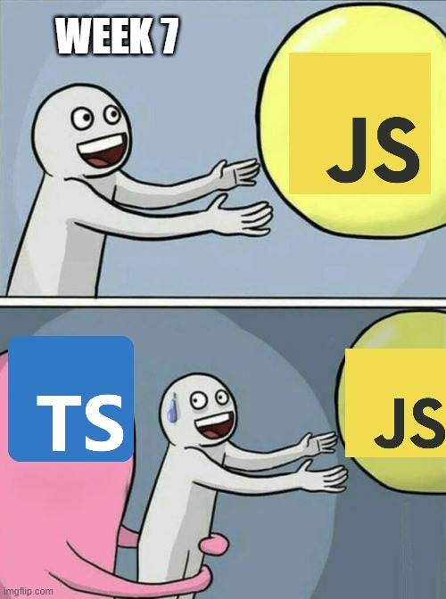
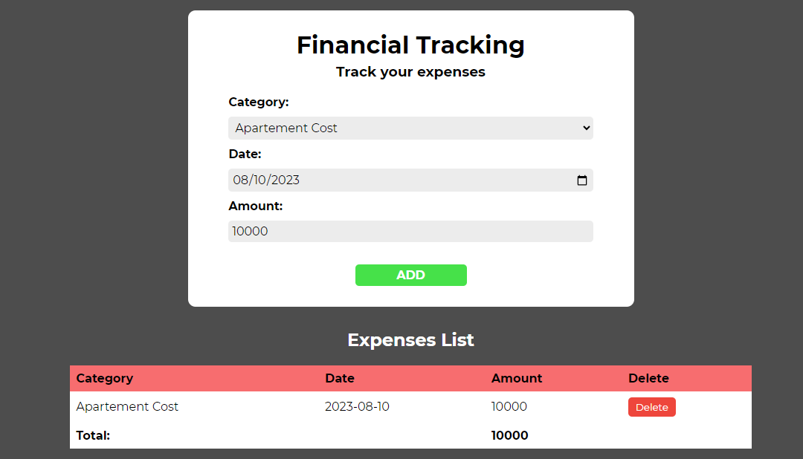
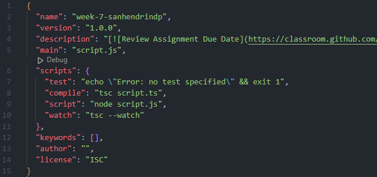

<p align="center">
    
</p>

<h5 align="center">Powered by</h5>
<p align="center"> <a href="https://www.w3.org/html/" target="_blank" rel="noreferrer">  </a><a href="https://www.w3schools.com/css/" target="_blank" rel="noreferrer">  </a>  <a href="https://developer.mozilla.org/en-US/docs/Web/JavaScript" target="_blank" rel="noreferrer">  <a href="https://www.typescriptlang.org/" target="_blank" rel="noreferrer">  <a href="https://nodejs.org" target="_blank" rel="noreferrer"> </a></a> </p>

<h5 align="center">Website Link</h5>
<p align="center">
<a href="https://sanhendrindp.site/">sanhendrindp.site</a>
</p>

# Project Description

In this week 7 assignment, i created an website app call Financial Tracking where users can input their expenses based on available categories. The expenses data will be shown on the table called Expenses List. Each expenses show on expenses list table can be delete by the users.

<p align="center">
    
    <br>
    <em>Website Overview</em>
</p>

# Initialization & Custom Script

This assignment is created using **Node.js** ecosystem. The first step to create Node.js project is using npm init to create a package called **package.json**.

```bash
npm init -y
```

After package.json created, the script is ready to be customized. Some of the customize script are:

1. **compile** : To compile the typescript file into javascript file.

2. **script** : To run scripts from the command line.

3. **watch** : To run watch mode.

<p align="center">
    
    <br>
    <em>Custom Script</em>
</p>

---

<p align="center">Thank you 🙏</p>

<p align="center">
  <a href="https://github.com/EddieHubCommunity" target="_blank" rel="noopener noreferrer">
    
 </a>
  <a href="https://github.com/EddieHubCommunity" target="_blank" rel="noopener noreferrer">
    
 </a>
  <a href="https://github.com/EddieHubCommunity" target="_blank" rel="noopener noreferrer">
    
 </a>
 </p>
